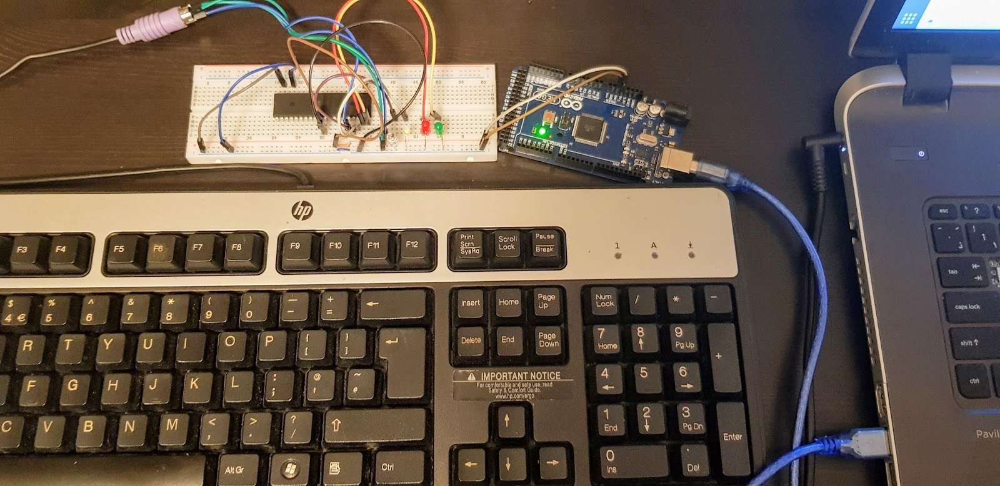
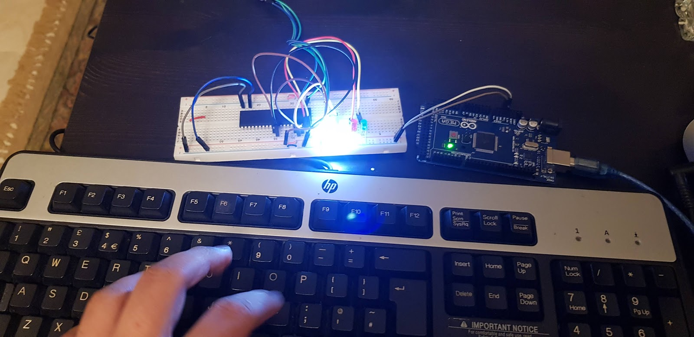

# keystroke-authenticator
An authentication protocol for authenticating users by detecting the travel time between keystrokes.
<table>
  <tr>
    <td>
      
    </td>
    <td>
      
    </td
  </tr>
</table>

## Technique
We attached a PS2 keyboard to an AtMega16A microcontroller, we detected each keystroke using the PS2 protocol implementation, and started an experiment to distinguish between two different users using a simple experiment.

## Experiment
1. Get two keyboard users. User A, and User B
2. Ask each user to input the sequence .tie5Ronal 5 times
3. After each user successful input trial, the difference between every keystroke is calculated, and averaged over the 5 trials
4. Using the values we got from the training phase, we start testing once on each user
5. Based on the euclidean distance between the training and testing vectors we determine which pattern this user is closer too.

## Hardware
1. Atmega16A
2. HP PS2 Keyboard
3. AVR custom made programmer and eeprom reader using avrdude drivers
4. Arduino Mega (Only for power supply)
5. LED indicators
